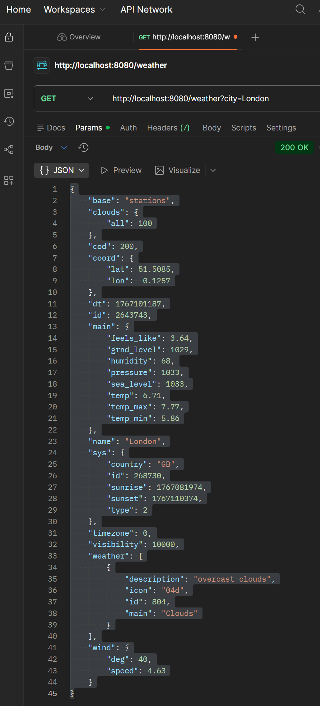

# Weather Microservices (WSGI, Flask)

Учебный проект по лабораторной работе №2: разработка микросервисов с использованием **Flask (WSGI), многопроцессности, Docker и serverless-подхода**.

Проект реализует агрегатор погодных данных в виде набора микросервисов:

[weather_service.py](services/weather_service.py) - Микросервис получения погодных данных по городу

[recommendation_service.py](services/recommendation_service.py) - Сервис формирования рекоменндаций на основе погоды

[history_service.py](services/history_service.py) - Сервис хранения истории запросов и статистики

[test_weather.py](tests/test_weather.py) - модульный тест сервиса погоды

[weather_providers.py](utils/weather_providers.py) - источники данных о погоде (OpenWeatherMap API и mock-провайдер)

[Dockerfile](Dockerfile) - инструкция сборки Docker-образа приложения

[app.py](app.py) - Точка входа WSGI-приложения, инициализация Flask и маршрутов

[requirements.txt](requirements.txt) - Список зависимостей Python-проекта

Взаимодействие между сервисами осуществляется в формате **JSON**.

Для повышения надежности Weather Service реализует параллельное обращение к нескольким источникам данных с использованием модуля **multiprocessing**.

## Запуск проекта в Docker

### 1. Сборка образа

```bash
docker build --no-cache -t weather-app .
```

### 2. Запуск контейнера

```bash
docker run -p 8080:8080 \
  -e OPENWEATHER_API_KEY=YOUR_API_KEY \
  weather-app
```

## HTTP-запросы



[GET http://localhost:8080/weather?city=Berlin](images/postman2.png)

[GET http://localhost:8080/weather?city=Tokyo](images/postman3.png)


